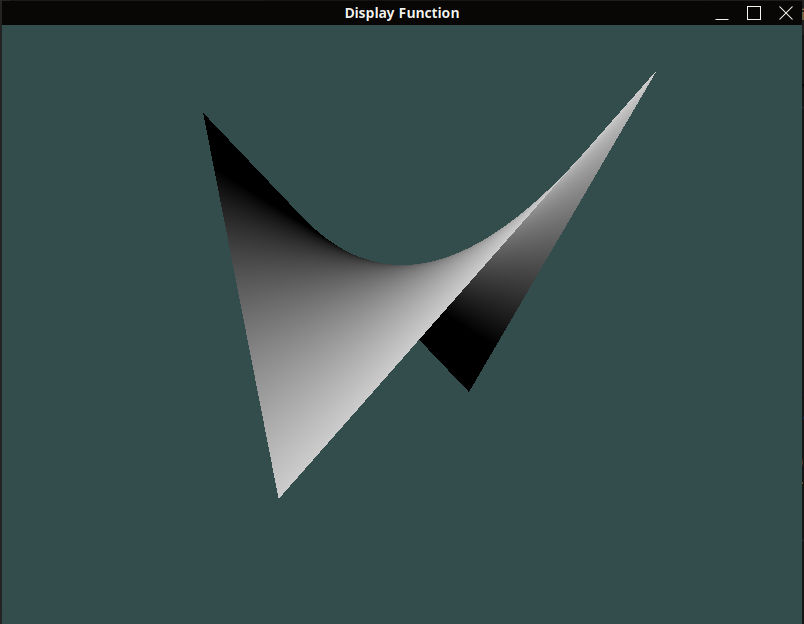

# Function Display
The purpose of this repository is to display mathematical functions as surfaces in a 3D Space (functions with the following signature $`f : \mathbb{R}^2 \to \mathbb{R}`$).

## First results : 
We first of all display a simple function ($`f : (x, y) \mapsto x \times y`$) with OpenGL.\medksip
